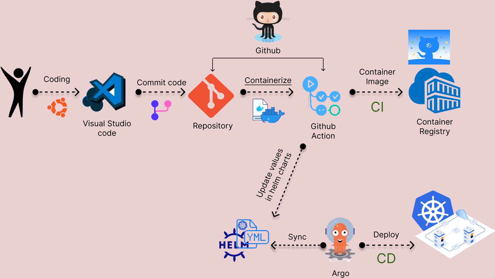

About

A Telegram bot that processes a message from users and responds to

Bot URL : https://t.me/asXFvvr_bot

How to use

Please use commands below to manage your notification

    /start hello - Returns the Bot version

How to build and run
Prerequisites (for all installation methods)

    Golang should be installed
    Bot token should be assigned to system env variable with name TELE_TOKEN
    telebot.Context in this code refers to the context of a Telegram message received by the bot.

Local build and run

    go build -ldflags "-X="github.com/den-vasyliev/kbot/cmd.appVersion=v1.0.0
    ./kbot start

Docker
    
    Build image: docker build -t kbot --build-arg APP_VERSION=$APP_VERSION .
    Run container: docker run -d --name kbot -e TELE_TOKEN=$TELE_TOKEN kbot
    Stop and remove container: docker stop kbot | docker rm kbot

Make

    # зінними TARGETOS та TARGETARCH обираємо бажану платформу та архітектуру
    make build TARGETOS=darwin TARGETARCH=arm64  - build app
    make image TARGETOS=darwin TARGETARCH=arm64  - build docker image with app
    make push TARGETOS=darwin TARGETARCH=arm64   - push docker image to gcr.io container registry
    make clean TARGETOS=darwin TARGETARCH=arm64  - delete docker image

    # без змінних TARGETOS та TARGETARCH по замовчуванню білд під linux_amd64
    make build 
    make image
    make push
    make clean

Continuous Integration/Continuous Deployment (CI/CD)

We use GitHub Actions for our CI/CD pipeline. Whenever a commit is made to the `develop` branch, the pipeline is triggered. The steps include:

1. Checkout the repository.
2. Install Go.
3. Login to the GitHub Container Registry.
4. Extract the repository name.
5. Build and push the image.
6. Install `jq` and `yq`, and perform SSH.
7. Checkout the repository.
8. Increment the version.
9. Modify `values.yaml`.
10. Commit and push the changes.

You can find the GitHub Actions workflow configuration file in `.github/workflows/cicd.yml`.

